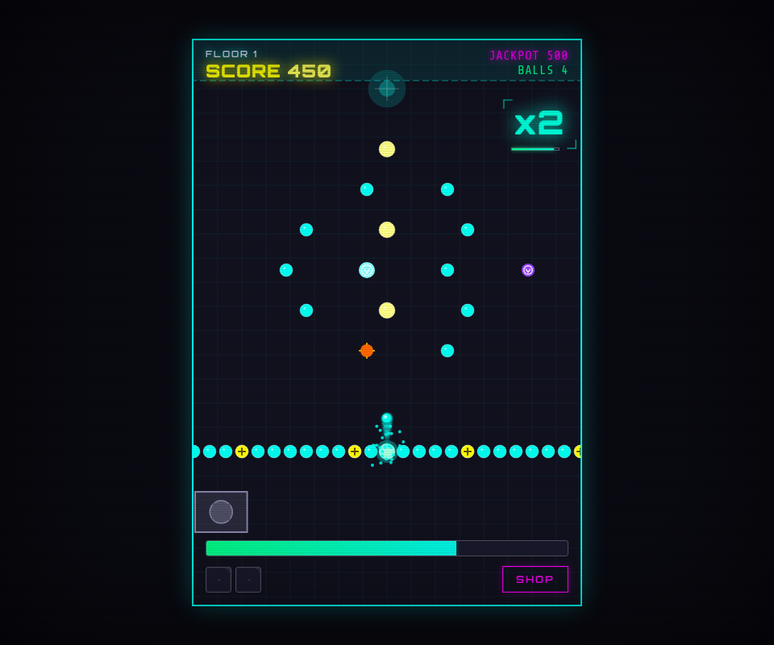
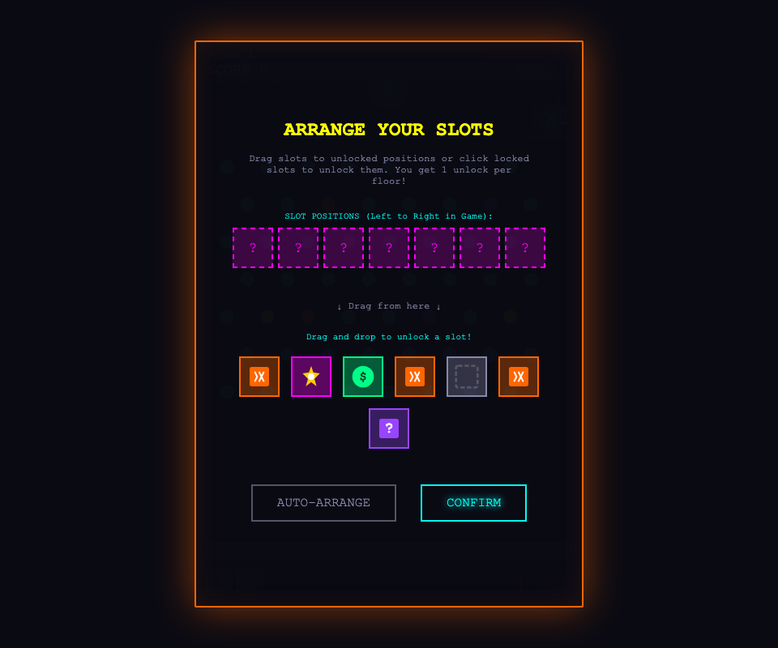
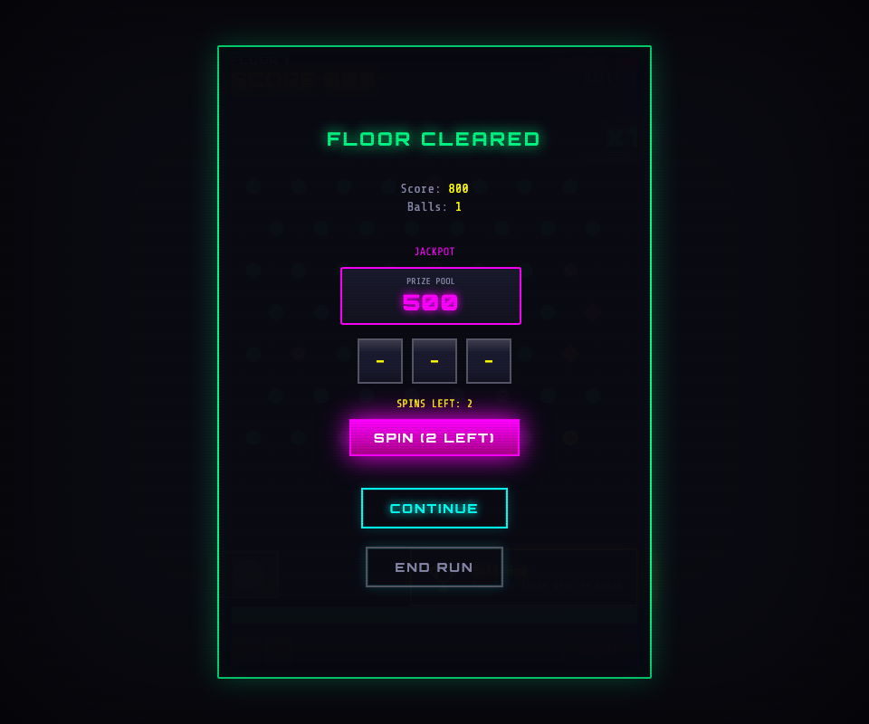
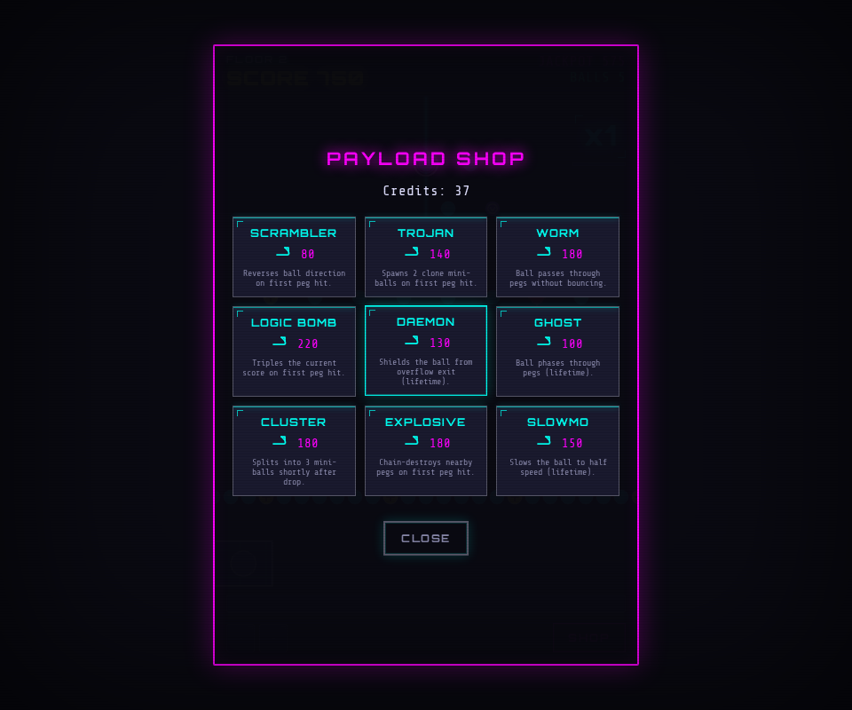
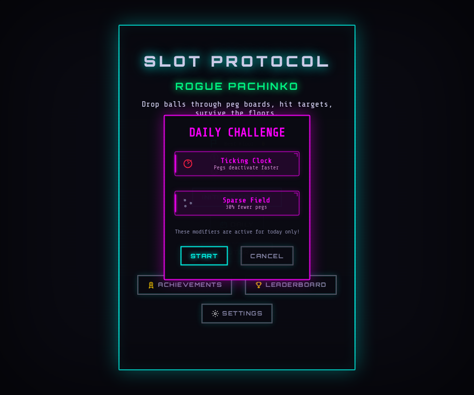
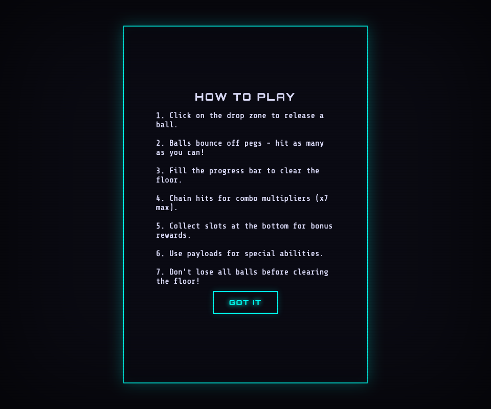
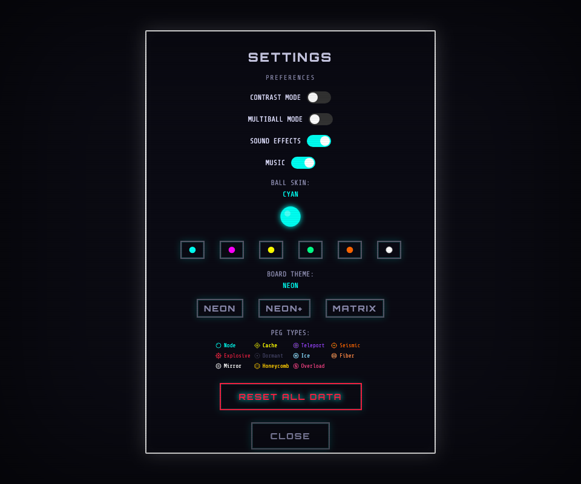

<div align="center">

# SLOT PROTOCOL

### Rogue Pachinko

*A cyberpunk-themed pachinko roguelike in a single HTML file. Drop balls
through procedurally-generated peg boards, chain hits for combo multipliers,
arrange slot effects between floors, and survive as long as you can.*

[](https://opensource.org/licenses/ISC)
[]()
[]()
[]()

</div>

---

## 🕹️ Play Now

**[👉 Play Slot Protocol](https://klampatech.github.io/slot-protocol/)**

No install, no download — just open the link in any modern browser.
Works on desktop and mobile.

---

## 🎮 Gameplay



You have **5 balls** to clear each floor's peg target. Drop a ball from
the top — gravity, friction, and the peg field do the rest. Chain peg
hits for combo multipliers, hit the right slots for bonus effects, and
arrange your loadout between floors. How deep can you go before you
run out of balls?

---

## 📸 Screenshots

| | |
|---|---|
|  |  |
| **Slot Selector** — between every floor, pick which slot positions to unlock and assign effects to them. | **Floor Cleared** — spin the 3-reel slot machine for a chance to win (or partially win) the jackpot. |
|  |  |
| **Payload Shop** — spend breach credits on 9 different one-shot or lifetime ball-modifying payloads. | **Daily Challenge** — a new seeded run every day with two random modifiers from 6 candidates. |
|  |  |
| **Tutorial** — first-time visitor onboarding. | **Settings** — contrast mode, multiball, SFX/BGM, ball skin, board theme, peg-type legend, full reset. |

---

## 🕹️ How to Play

### Controls
- **Tap or click anywhere on the board** to drop a ball from the top
  (the prediction line shows the first bounce point).
- **Touch and mouse both work** — the game is fully mobile-compatible.
- Between floors, **tap a slot effect to pick it up, then tap a position
  to place it** (or tap a locked position to unlock it).

### The core loop

1. **Drop a ball** from the top of the play field. Gravity pulls it
   down through the peg field.
2. **Hit pegs** to score points. Each hit advances the floor's peg
   target and builds your combo multiplier.
3. **Reach the floor's target** before you run out of balls to clear
   the floor.
4. **Between floors**: arrange which slot effects are active, spin
   the slot machine for a jackpot bonus, and optionally buy payloads
   in the shop.
5. **Run ends** when you clear all your balls without hitting the peg
   target. Your score is added to the leaderboard.

### Combo system
- Each consecutive peg hit advances the multiplier (×1 → ×2 → … → ×7).
- Hit **5 pegs in a row** to enter **Frenzy** mode (×3 on all scoring
  for 3 seconds).
- The chain timer (0.6s at 60fps) refreshes on every hit — keep
  the ball alive to keep the chain going.
- The chain breaks when the ball exits the field without hitting a
  peg or when the timer expires.

### Peg types (11)
Different colored pegs behave differently when hit:

| Color | Type | Effect |
|---|---|---|
| 🔵 Cyan | **Node** | Standard bounce. 50×(combo+1) base points, scales with floor. |
| 🟡 Yellow | **Cache** | High-value: 200 + combo×50 pts, counts toward objective on destruction. |
| 🟣 Purple | **Teleport** | Swaps the ball's position with its paired teleport peg. |
| 🟠 Orange | **Seismic** | +100 flat bonus, shockwave, screen shake. |
| 🔴 Red | **Explosive** | Chain-destroys nearby pegs on hit. |
| ⚪ Grey | **Dormant** | Starts inactive; activates when a ball comes near. |
| ❄️ Light blue | **Ice** | First hit freezes; second hit = +150 + combo×75. |
| 🟧 Orange-red | **Fiber** | 3-hit cycle. Final hit breaks the peg for +300 + combo×100. |
| ⚪ White | **Mirror** | Deflects the ball horizontally in a stored direction. |
| 🟨 Gold | **Honeycomb** | 5-hit cycle. Final hit = +500 + combo×150 and attracts nearby pegs. |
| 🩷 Pink | **Overload** | +75 pts but drains 10% of the jackpot. Erratic bounce. |

### Slot effects (8)
At the bottom of the board are 7 positions. Each floor, you unlock
one more and assign it a random slot effect from a 3-card pool:

| Effect | What it does |
|---|---|
| **OVERFLOW** | Ball gets launched back up for a second pass through the pegs. |
| **CREDITS** | +base×(combo+1)×(frenzy?3:1) score. Scales with floor. |
| **AMPLIFY** | +1 combo (capped at ×7), chain timer refreshes. Activates frenzy at combo ≥ 3. |
| **PAYLOAD** | Adds a random payload to your queue. |
| **CRUMBLE** | Destroys up to 3 random pegs. With Chain Reaction: creates 3 pegs instead. |
| **SHIELD** | Bounces the next ball back from overflow. With Daemon: super bounce. |
| **MAGNETIZE** | Pulls nearby pegs toward the ball’s landing point. |
| **JACKPOT** | Adds the current jackpot to your score + credits bonus; jackpot grows 15% if missed. |

### Payloads (12)
Bought in the shop, consumed on the **next ball drop** (all queued
payloads fire simultaneously — Phase 8c loadout model). 2 slots at
floor 1, scaling +1 every 10 floors (so 3 at fl 10, 4 at fl 20, etc.).
Several payloads interact with specific peg types (see REDESIGN.md).

| Payload | Cost | Effect |
|---|---|---|
| **Ricochet** | 90 | Ball gets 3 smart bounces toward unhit pegs on first hit. |
| **Phase** | 110 | Phase through pegs + warp back to drop zone once for a second pass. |
| **Daemon** | 140 | Shields the ball from overflow exit for its lifetime. |
| **Trojan** | 150 | Spawns 2 clone mini-balls (inherit parent’s payload flags). |
| **Stasis** | 170 | Freeze mid-air 30 frames, attract pegs, resume at half speed. |
| **Magnetize** | 170 | Pegs within 80px attracted toward the ball (lifetime). |
| **Synergy** | 180 | Cache, Ice, Fiber, and Honeycomb pegs give 2× score. |
| **Detonator** | 200 | Each peg hit triggers a targeted explosion. Boom on every bounce. |
| **Cluster** | 200 | Splits into 3 mini-balls shortly after drop. |
| **Tunnel** | 220 | Pass through pegs (tagged = 2× score). Tagged pegs explode on exit. |
| **Chain Reaction** | 240 | Each peg hit triggers an AoE explosion (30px radius). |
| **Logic Bomb** | 250 | Triples the current score on first peg hit. |

### Daily challenge
A new seeded run every day with **2 random modifiers from 6**:
- **Heavy Gravity** — 1.5× gravity
- **Sparse Field** — 30% fewer pegs
- **Tiny Ball** — ball is 60% size
- **Ticking Clock** — pegs deactivate faster
- **Lower Multiplier** — max combo is ×4 instead of ×7
- **Double Trouble** — pegs worth half their normal value

Hard-tier modifiers (Ticking Clock, Lower Multiplier, Double Trouble)
are deduplicated — you won't get two of them on the same day.

### Meta-progression
- **17 achievements** to unlock (first peg hit, x5 combo, jackpot win,
  floor 5/10/20, 10,000+ score, etc.)
- **Local leaderboard** (top 10) for high-score chasing
- **Daily streak** tracking
- **6 ball skins** and **3 board themes** to customize the look
- All progress persists in `localStorage`

---

## 🏗️ Architecture

```
slot-protocol/
├── index.html              (8,385 lines — the entire game)
│   ├── <style>             (~300 lines of cyberpunk CSS)
│   ├── <body>              (~570 lines of HTML overlays)
│   └── <script>            (~5,700 lines of vanilla JS, IIFE-wrapped)
│       ├── Constants (C)   — physics, peg/slot enums, tooltip data, payload metadata
│       ├── GameState (GS)  — runtime state (board, balls, slots, payloads)
│       ├── Persistence     — localStorage-backed save/load
│       ├── Audio engine    — Web Audio SFX + HTML5 BGM
│       ├── Ball / Peg classes
│       ├── Board generation (6 templates + 25-peg wall row)
│       ├── Physics (gravity, friction, collision)
│       ├── Slot arrangement (drag/tap to place)
│       ├── Slot effects (8 types)
│       ├── 9 Payload effects
│       ├── Slot machine mini-game
│       ├── Daily challenge
│       ├── Prediction line (bounce-aware lookahead)
│       ├── Settings (contrast, multiball, skins, themes)
│       └── 11 in-game tooltips
├── svg-icons.js            (neon-line-art icon set, 30+ icons)
├── audio/                  (3 BGM tracks)
├── tests/
│   ├── unit.js             (381 Playwright unit tests)
│   ├── performance-validation.js  (20 perf tests)
│   ├── screenshot-suite.js (16 visual assertions across 16 captures)
└── mobile.js           (54 mobile device-emulation tests)
│   └── screenshots/        (regenerated on every test run)
├── GOAL.md                 (the living spec — full project history)
└── README.md               (this file)
```

**Single-file build** — the entire game ships in `index.html`. No
build step, no bundler, no framework. Just open the file in a browser
(or serve it over HTTP for the audio assets to load).

**Tech**: vanilla JS, HTML5 Canvas, Web Audio API, HTML5 Audio,
localStorage, CSS Grid + Flexbox, custom Orbitron + Share Tech Mono
typography from Google Fonts.

**No runtime dependencies.** The only dev dependency is
[Playwright](https://playwright.dev/) (for the test suite).

---

## 🧪 Running & Testing

### Just play
```bash
# Open in a browser
open index.html        # macOS
xdg-open index.html    # Linux
start index.html       # Windows

# Or serve it (for the BGM files to load cleanly):
python3 -m http.server 8000
# then open http://localhost:8000
```

### Test suite
The repo has **three** test suites, all wired into CI:

```bash
npm install            # install Playwright
npm test               # 20 performance validation tests (FPS, memory, edge cases)
npm run test:unit      # 183 unit tests (state, physics, scoring, payloads, etc.)
npm run test:screenshot # 11 visual assertions + 16 regenerated screenshots
```

The **screenshot suite** is the interesting one — it actually reads
back the canvas pixel data after each capture to verify the game
rendered correctly. It would have caught the `ts` render-loop bug
(see [PR #3](https://github.com/klampatech/slot-protocol/pull/3)).

CI runs all three suites on every push and PR. See
[`.github/workflows/ci.yml`](.github/workflows/ci.yml).

### Browser support
- **Desktop**: any modern browser (Chrome, Firefox, Safari, Edge)
- **Mobile**: iOS Safari 16.4+, Android Chrome (full touch + tap
  feedback; portrait orientation locked by default)

---

## 🎨 Design notes

- **Aesthetic**: cyberpunk hacker — neon cyan, magenta, yellow, and
  green on near-black. Orbitron for HUD/title typography, Share Tech
  Mono for body. Blade Runner 2049 direction (Phase 3).
- **Single 480×700 canvas**, scaled to fit the viewport via a CSS
  `transform: scale()` wrapper (Phase 5 mobile compatibility).
- **CRT scanlines + vignette** overlay (subtle, gated on
  `prefers-reduced-motion`).
- **Every peg and slot has a tooltip** anchored to the mouse/finger
  (Phase 2c + Phase 8a).
- **Bounce-aware prediction line** — 2-bounce lookahead with a
  marker ring on the first peg the ball will hit (Phase 6).

---

## 📜 Project history

The full feature history lives in [`GOAL.md`](GOAL.md) — a living
spec that's been updated as each phase shipped. Highlights:

- **Phase 0–1**: cleanup, cosmetic consistency
- **Phase 2a–c**: daily challenge, all 9 payloads, in-game tooltips
- **Phase 3**: visual overhaul (Blade Runner 2049 direction)
- **Phase 4**: audio engine (Web Audio SFX + HTML5 BGM)
- **Phase 4.5** (A–Q): economy-balancing pass
- **Phase 5/5b/6/7/7b/7c**: mobile compatibility, prediction line, 6
  board templates + wall row, tooltip hoisting fixes
- **Phase 8a/8b/8c**: payload tooltips, dynamic slot cap, flatten +
  consume-all-on-drop + dedup
- **Code-review pass**: 11 issues addressed (XSS, IIFE wrap, `var`→
  `const`/`let`, dead code, console logs, HUD DOM caching, error
  boundary)
- **Test infrastructure**: 214 tests total, all wired into GitHub
  Actions CI

381 unit tests, 20 performance tests, 16 screenshot tests, 54 mobile
tests. The full spec is in `GOAL.md`. Design analysis in `REDESIGN.md`.

---

## 📄 License

ISC — see [`LICENSE`](LICENSE) (or the absence of one; this project
predates the LICENSE file convention but the `package.json` declares
`"license": "ISC"`).
